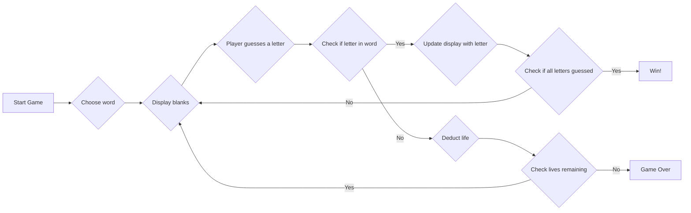

## Flow Chart

```mermaid
graph LR
A[Start Game] --> B{Choose word}
B --> C{Display blanks}
C --> D{Player guesses a letter}
D --> E{Check if letter in word}
E -- Yes --> F{Update display with letter} 
E -- No --> G{Deduct life}
F --> H{Check if all letters guessed}
H -- Yes --> I[Win!]
H -- No --> C
G --> J{Check lives remaining}
J -- Yes --> C
J -- No --> K[Game Over]
```