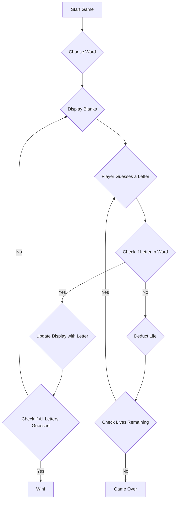

# Hangman Game

## Flowchart

## Explanation:

- **Start Game (A):** The game begins.
- **Choose Word (B):** The game randomly selects a word for the player to guess.
- **Display Blanks (C):** The blanks representing each letter of the word are shown to the player.
- **Player Guesses a Letter (D):** The player guesses a letter.
- **Check if Letter in Word (E):** Determine if the guessed letter is in the chosen word.
    - **Yes (F):** If the letter is in the word, update the display to reveal the letter's positions.
    - **No (G):** If the letter is not in the word, deduct a life from the player.
- **Check if All Letters Guessed (H):** Check if the player has guessed all the letters in the word.
    - **Yes (I):** If all letters are guessed, the player wins the game.
    - **No (C):** If there are still letters left to guess, continue the game.
- **Check Lives Remaining (J):** Check if the player has any lives remaining.
    - **Yes (D):** If the player has lives left, allow them to continue guessing.
    - **No (K):** If the player has no lives left, the game is over, and the player loses.

This flowchart outlines the sequential steps of the Hangman game, guiding the player through the process of guessing
letters and determining the outcome of each guess until either the word is completely guessed or the player runs out of
lives.